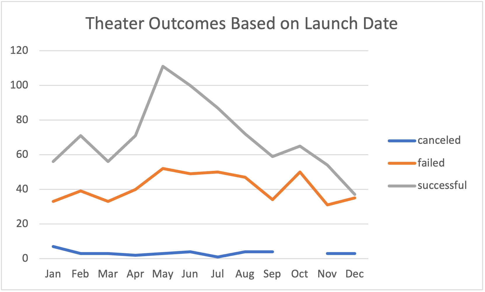
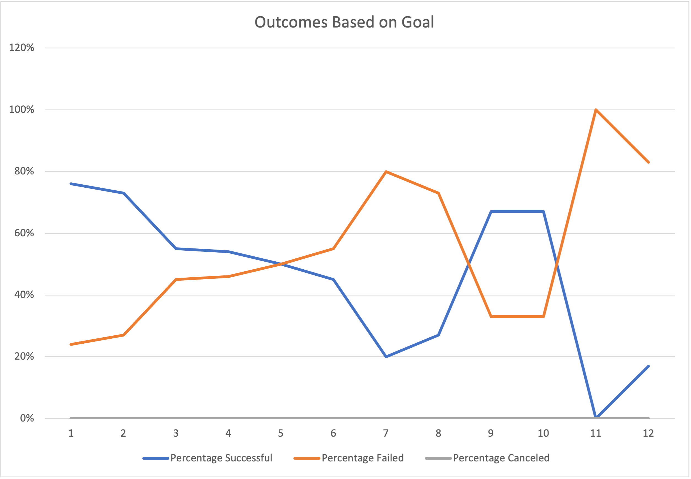

# Kickstarting with Excel
## Overview of Project
### This project was to analyize the Kickstarter Campaign datasets by using PivotTable and different types of functions such as COUNTIFS and SUM. After the analysis, the datas were visualized using different types of tables that were best for each data.
## Analysis and Challenges
### How analysis was performed: I was able to perform my analysis using images on each module to help myself guide through to make sure that I was following the instructions and using the correct functions and tables. 
### Challenges and Difficulties Encountered: Some of the challenges I faced while analying this data was not being able to remember some functions so having to go back and forth each modules.
## Results
- Two conclusions I can draw about the Theater Outcomes by Launch Date is that the successful rate spiked starting from May and started to decrease up until December and that the canceled rate did not show much ups or downs compared to the successful and faield rates.
- On the Outcomes Based on Goals, we can see that the sucessful and failed percentage is showing trends that are opposite from each other.
- Some of the limitations of this dataset is that some columns that were needed in order for the analysis were not in place so it had to be created manually.
- Some other possible tables and/or graphs we could create are table showing the number of backers for each parent category or subcategory, graphs showing pledged amounts by launched date per country, and table or graph showing the outcomes results based on country.
### 
### 
